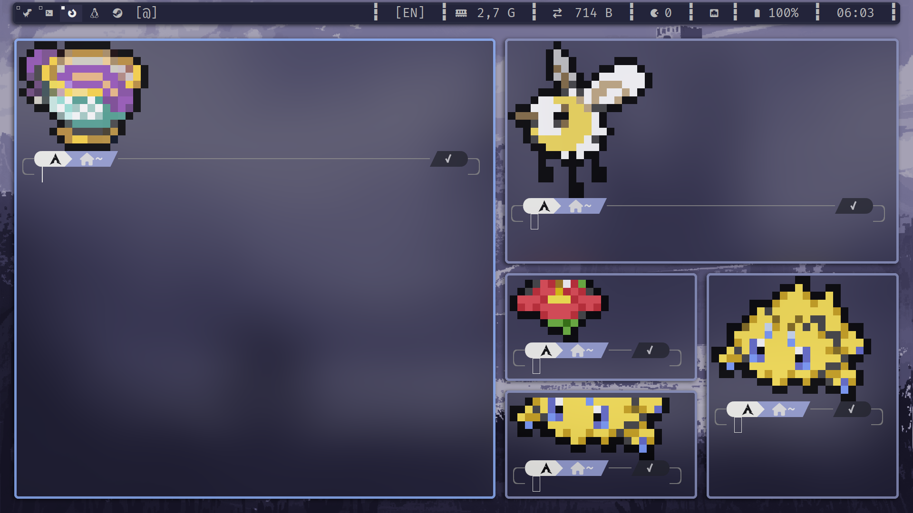
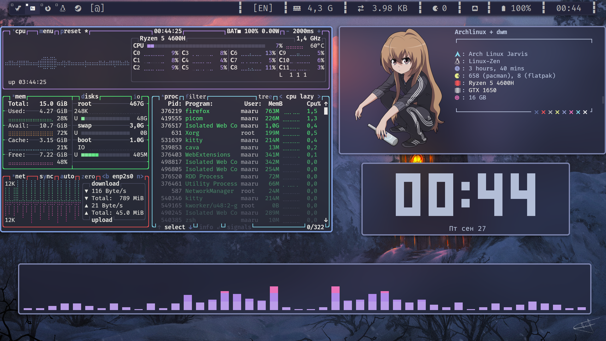
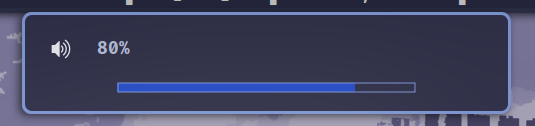
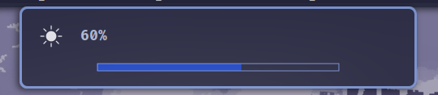

# dwmDots-maaru


welcome this is my dotfile form dwm

1. [install](#install)
2. [KeyBinds](#KeyBinds)
3. [Patches](#Patches)
4. [ScreenShot](#ScreenShots)
   <br/>

# Patches

1. [actualfullscreen](https://dwm.suckless.org/patches/actualfullscreen/) <br/>
   Actually toggle fullscreen for a window, instead of toggling the status bar and the monocle layout. <br/> <br/>
2. [alwayscenter](https://dwm.suckless.org/patches/alwayscenter/)<br/>All floating windows are centered, like the center patch, but without a rule.
   <br/> <br/>
3. [barpadding](https://dwm.suckless.org/patches/barpadding/)<br/>This patch adds variables for verticle and horizontal space between the statusbar and the edge of the screen;
   <br/><br/>
4. [borderbar](https://github.com/maarutan/dwmDots-maaru/blob/main/suckless/dwm/patches/barpadding.diff)<br/>
   adding border bar<br/><br/>
5. [movestack](https://dwm.suckless.org/patches/movestack/)<br/>
   This plugin allows you to move clients around in the stack and swap them with the master.<br/><br/>
6. [notitle](https://dwm.suckless.org/patches/notitle/)<br/>
   Doesn't show the title. <br/><br/>
7. [pertag](https://dwm.suckless.org/patches/pertag/)<br/>
   Этот патч сохраняет макет, mwfact, barpos и nmaster для каждого тега. <br/><br/>
8. [resizehere](https://dwm.suckless.org/patches/resizehere/)<br/>
   Changes the resizing behaviour. Instead of warping the pointer to the bottom right corner, the pointer will stay in the same place and the window will resize as you move your mouse.
   <br/><br/>
9. [vanitygaps](https://dwm.suckless.org/patches/vanitygaps/)<br/>ability to control all intervals simultaneously
   <br/><br/>
10. [Tiledmove](https://dwm.suckless.org/patches/tiledmove/)<br/>Patch to make the function movemouse not force clients to float.
    Tiled clients when moved will swap with other tiled clients that overlap with the cursor, and snap to other monitors.
    <br/><br/>

# ScreenShots





# dunst volume control



<p>
I wrote a script that runs volume control in dunst <br/>
----script tested on pipwire----
</p>

[voleme.sh](https://github.com/maarutan/dwmDots-maaru/blob/main/suckless/scripts/volume.sh)

# dunst brightness control



<p>
also a dunst script for brightness control<br/>
---- working in brightnessctl ---- 
</p>

[brightnessControl.sh](https://github.com/maarutan/dwmDots-maaru/blob/main/suckless/scripts/brightnessControl.sh)

# Picom Siple Animation

[AUR - picom-simpleanims-git ](https://aur.archlinux.org/packages/picom-simpleanims-git)
<br/>
this picom have a best animations

# Keybinds

`super + return` - kitty <br/>
`super + q` - killactive<br/>

`super + shift + w` - toggle bar<br/>
`super + shift + f` - firefox<br/>
`super + shift + v` - vencord<br/>
`super + c` - code <br/>

`super + ctrl + u` - updatesystem<br/>
`caps + alt` - change keyboard<br/>

`super + r` - rofi drun<br/>
`super + v` - rofi buffer<br/>
`super + alt + a` - rofi emoji<br/>
`super + shift + p` - rofi powermenu<br/>

`super + alt + p` - colorpicker (xcolor)<br/>
`super + p` - flameshot gui (screenshot)<br/>

`super + i` - cd ~suckless/dwm/ (settings)<br/>
`super + e` - yazi (explorer)<br/>

`super + ctrl + [` - change wallpaper (left)<br/>
`super + ctrl + ]` - change wallpaper (right)<br/>

`super + [` - change volume + (up)<br/>
`super + ]` - change volume - (down)<br/>
`super + \` - change volume mute (mute)<br/>

`super + shift + [` - change brightness + (up)<br/>
`super + shift + ]` - change brightness - (down)<br/>

`super + shift + j` - focusstack +1 (up)<br/>
`super + shift + k` - focusstack -1 (down)<br/>
`super + shift + h` - resizeWin + (up)<br/>
`super + shift + l` - resizeWin - (down)<br/>

`super + ctrl + j` - movestack +1 (up)<br/>
`super + ctrl + k` - movestack -1 (down)<br/>
`super + ctrl + return` - window swap<br/>

`super + f` - fullscreen<br/>

`super + w` - toggle flouting<br/>

`super + alt + 1` - stacType (spiral) <br/>
`super + alt + 2` - stacType (dwindle) <br/>
`super + alt + 3` - stacType (tile) <br/>
`super + alt + 4` - stacType (bstack) <br/>
`super + alt + 5` - stacType (centeredmaster) <br/>
`super + alt + 6` - stacType (nrowgrid) <br/>
`super + alt + 7` - stacType (grid) <br/>
`super + alt + 8` - stacType (gaplessgrid) <br/>
`super + alt + 9` - stacType (bstackkhoriz) <br/>
`super + alt + 0` - stacType (desk) <br/>

# install

Instructions for installing and configuring the project. For example:

```bash
# clone repositories
$ git clone https://github.com/maarutan/dwmDots-maaru.git

# go to
$ cd dwmDots-maaru

# starting scripts
$ ./start.sh

#installing...
```
